# Predicting Bus Occupancy Levels For One Route Using a "Simple" Transformer-Based Model

## Introduction
Predicting bus occupancy levels at bus stops is critical for optimizing public transportation systems, improving passenger experience, and reducing inefficiencies. This article presents a transformer-based model designed to classify bus occupancy into three categories: **Empty (0)**, **Half Full (1)**, and **Full (2)**. The model leverages temporal, spatial, and environmental features to make predictions, addressing challenges such as class imbalance and variable-length trip data.

---

## Dataset Description

**Small subset of the dataset**
> The model is trained on a small subset of the dataset to demonstrate its effectiveness. It uses only data from a single route over one month, avoiding the complexity of multi-route or multi-month data. For example, for dealing with 1000's of routes, it would be required an embedding layer to encode the route information. In this sense, the features extracted from the raw data are not exhaustive, and additional features could be included to enhance model performance.

The dataset consists of JSONL files containing trip records from a single route over one month. Each record includes features such as timestamp, weather conditions, and bus stop location. The dataset is pre-split into training (80%), validation (10%), and test (10%) sets:

- **Training**: 633 trips, 38,762 records
- **Validation**: 78 trips, 4,495 records
- **Test**: 78 trips, 5,002 records

### Feature Extraction
The raw data is processed to extract the following features:
- **Temporal Features**: `sin_hour`, `cos_hour`, `sin_day`, `cos_day` (cyclic encoding for time)
- **Spatial Features**: `normalized_bus_stop_location`
- **Delay**: `delay_minutes_standardized`
- **Weather**: `temperature_standardized`, `precipitation_standardized`

These features are standardized to ensure consistent input scaling. The target variable is `occupancy_level`.


### Class Distribution
The dataset exhibits class imbalance:
- **Empty (0)**: 17,787 samples (37.9%)
- **Half Full (1)**: 22,718 samples (48.4%)
- **Full (2)**: 7,754 samples (16.7%)

To address this imbalance, class weights are applied during training:
- Empty: 0.90
- Half Full: 0.71
- Full: 2.07

---
<div style="page-break-after: always;"></div>

## Model Architecture
The model is a transformer-based architecture with the following components:

### 1. Input Embedding
The input features are passed through a linear layer to project them into a higher-dimensional embedding space (`hidden_dim=1024`). This step ensures that the model can capture complex relationships between features.

### 2. Positional Encoding
Positional encoding is used to inject information about the sequence order into the embeddings. This is crucial for transformers, which lack inherent sequential awareness. The encoding uses sine and cosine functions:
```python
pe[:, 0::2] = sin(position * div_term)
pe[:, 1::2] = cos(position * div_term)
```

### 3. Transformer Encoder
The core of the model is a stack of transformer encoder layers (`num_encoder_layers=6`) with multi-head self-attention (`nhead=8`). Each layer processes the input sequence in parallel, capturing dependencies across all positions.

### 4. Classification Head
A two-layer MLP with ReLU activation and dropout is used as the classification head. It outputs logits for each occupancy level.

### Justification
- **Transformers**: Transformers excel at modeling sequential data and capturing long-range dependencies, making them ideal for trip-based predictions.
- **Positional Encoding**: Ensures the model understands the temporal order of bus stops.
- **Class Weights**: Mitigates the impact of class imbalance by emphasizing minority classes during training.
- **Sequence-to-Sequence Prediction**: The model predicts the occupancy level for each bus stop in a trip, enabling detailed insights into occupancy patterns.

---

### 5. **Model Output**
The model predicts **the occupancy level for each bus stop in a trip**. Specifically:
- The input to the model is a sequence of features corresponding to **all bus stops in a single trip**.
- The output is a sequence of predictions, where each prediction corresponds to the occupancy level (`0`, `1`, or `2`) at each bus stop in the trip.

Thus, the model performs **sequence-to-sequence prediction**, meaning it takes a sequence of inputs (features for all bus stops in a trip) and outputs a sequence of predictions (occupancy levels for all bus stops).

---
##### Model Architecture Diagram

```mermaid
flowchart TD
    %% Define styles and colors
    classDef input fill:#7986CB,stroke:#1A237E,color:white,stroke-width:2px
    classDef embedding fill:#4DB6AC,stroke:#004D40,color:white,stroke-width:2px
    classDef position fill:#FFB74D,stroke:#E65100,color:white,stroke-width:2px
    classDef transformer fill:#EF5350,stroke:#B71C1C,color:white,stroke-width:2px
    classDef classifier fill:#9575CD,stroke:#311B92,color:white,stroke-width:2px
    classDef output fill:#81C784,stroke:#1B5E20,color:white,stroke-width:2px
    
    %% Nodes with descriptions
    A["🔢 Input Features
    (temporal, spatial, weather features)"]
    B["📈 Input Embedding
    Linear projection to hidden_dim=1024"]
    C["📊 Positional Encoding
    Injects sequence order information"]
    D["🔄 Transformer Encoder
    6 layers with 8 attention heads each"]
    E["🧠 Classification Head
    2-layer MLP with ReLU & dropout"]
    F["🎯 Output
    Occupancy Level Predictions (0,1,2)"]

    %% Flow connections
    A -->|"Feature vector"| B
    B -->|"Embedded tensor"| C
    C -->|"Position-aware tensor"| D
    D -->|"Contextual representations"| E
    E -->|"Class logits"| F
    
    %% Apply styles
    class A input
    class B embedding
    class C position
    class D transformer
    class E classifier
    class F output
```



---

## PyTorch Implementation
The model is implemented in PyTorch, leveraging the `torch.nn.TransformerEncoder` module for the transformer encoder.
Code block extracted from the full project showing the model implementation:
```python
class BusOccupancyTransformer(nn.Module):
    """
    Transformer model for predicting bus occupancy levels.
    Uses a transformer encoder architecture with a classification head.
    """
    def __init__(
        self,
        input_dim: int,
        hidden_dim: int,
        nhead: int,
        num_encoder_layers: int,
        num_classes: int = 3,
        dropout: float = 0.1,
        use_positional_encoding: bool = True,
        max_seq_len: int = 100,
        use_cls_token: bool = True
    ):
        """
        Initialize the transformer model.
        
        Args:
            input_dim: Dimension of input features
            hidden_dim: Dimension of hidden layers
            nhead: Number of attention heads
            num_encoder_layers: Number of transformer encoder layers
            num_classes: Number of output classes
            dropout: Dropout rate
            use_positional_encoding: Whether to use positional encoding
            max_seq_len: Maximum sequence length
            use_cls_token: Whether to use a CLS token for classification
        """
        super().__init__()
        self.use_positional_encoding = use_positional_encoding
        self.use_cls_token = use_cls_token
        self.hidden_dim = hidden_dim
        
        # Input embedding layer
        self.embedding = nn.Linear(input_dim, hidden_dim)
        
        # Positional encoding
        if use_positional_encoding:
            self.pos_encoder = PositionalEncoding(hidden_dim, dropout, max_seq_len)
        
        # CLS token for classification (learnable parameter)
        if use_cls_token:
            self.cls_token = nn.Parameter(torch.randn(1, 1, hidden_dim))
        
        # Transformer encoder
        encoder_layers = nn.TransformerEncoderLayer(
            d_model=hidden_dim,
            nhead=nhead,
            dim_feedforward=hidden_dim * 4,
            dropout=dropout,
            batch_first=False
        )
        self.transformer_encoder = nn.TransformerEncoder(
            encoder_layers,
            num_encoder_layers
        )
        
        # Classification head
        self.classifier = nn.Sequential(
            nn.Linear(hidden_dim, hidden_dim),
            nn.ReLU(),
            nn.Dropout(dropout),
            nn.Linear(hidden_dim, num_classes)
        )
        
        self._init_weights()
        
    def _init_weights(self):
        """Initialize the model weights."""
        for p in self.parameters():
            if p.dim() > 1:
                nn.init.xavier_uniform_(p)
    
    def forward(self, x: torch.Tensor, mask: Optional[torch.Tensor] = None) -> torch.Tensor:
        """
        Forward pass of the model.
        
        Args:
            x: Input tensor of shape [seq_len, batch_size, feature_dim]
            mask: Mask tensor for padding, shape [batch_size, seq_len]
            
        Returns:
            Output tensor with logits for each position, shape [batch_size, seq_len, num_classes]
        """
        # [seq_len, batch_size, feature_dim] -> [seq_len, batch_size, hidden_dim]
        x = self.embedding(x)
        
        if self.use_positional_encoding:
            x = self.pos_encoder(x)
        
        # Apply transformer encoder
        # [seq_len, batch_size, hidden_dim] -> [seq_len, batch_size, hidden_dim]
        if mask is not None:
            x = self.transformer_encoder(x, src_key_padding_mask=mask)
        else:
            x = self.transformer_encoder(x)
        
        # Reshape for classification
        # [seq_len, batch_size, hidden_dim] -> [batch_size, seq_len, hidden_dim]
        x = x.transpose(0, 1)
        
        # Apply classifier to each position independently
        batch_size, seq_len, _ = x.shape
        
        # Reshape to apply classifier efficiently
        x_reshaped = x.reshape(-1, self.hidden_dim)  # [batch_size*seq_len, hidden_dim]
        x_classified = self.classifier(x_reshaped)  # [batch_size*seq_len, num_classes]
        
        # Reshape back to sequence format
        x_output = x_classified.reshape(batch_size, seq_len, -1)  # [batch_size, seq_len, num_classes]
        
        return x_output
```
---
<div style="page-break-after: always;"></div>

### **How Data is Fed to the Model**
The data is structured as follows:
1. **Input Format**:
   - Each trip is represented as a sequence of bus stops.
   - For each bus stop, the following features are extracted:
     - Temporal features: `sin_hour`, `cos_hour`, `sin_day`, `cos_day` (cyclic encoding for time).
     - Spatial feature: `normalized_bus_stop_location` (relative position of the bus stop along the route).
     - Delay: `delay_minutes_standardized`.
     - Weather: `temperature_standardized`, `precipitation_standardized`.

2. **Batch Construction**:
   - A batch consists of multiple trips.
   - Since trips can have variable lengths (different numbers of bus stops), the data is padded to the length of the longest trip in the batch.
   - A **mask** is used to indicate which positions in the sequence are padded (invalid) so that the model ignores them during training and evaluation.

3. **Collate Function**:
   - The `collate_fn_transformer` function prepares the data for the model:
     - It pads sequences to the maximum length in the batch.
     - It creates a mask tensor to identify valid (non-padded) positions.
     - It organizes the data into tensors: `features`, `masks`, and `targets`.

4. **Feeding Data to the Model**:
   - During training and evaluation, the data is fed to the model in batches.
   - For each trip in the batch:
     - The sequence of features for all bus stops is passed to the model.
     - The model processes the sequence using its transformer encoder and outputs predictions for all bus stops.

---

### **Example**
Suppose we have a batch of two trips:
- **Trip 1**: 5 bus stops.
- **Trip 2**: 3 bus stops.

The `collate_fn_transformer` function will:
1. Pad both trips to the maximum length (5 bus stops).
2. Create a mask tensor to indicate valid positions:
   ```
   Mask for Trip 1: [False, False, False, False, False]  # No padding
   Mask for Trip 2: [False, False, False, True, True]    # Last two positions are padded
   ```
3. Organize the data into tensors:
   - `features`: Tensor of shape `[batch_size, max_seq_len, feature_dim]`.
   - `masks`: Tensor of shape `[batch_size, max_seq_len]`.
   - `targets`: Tensor of shape `[batch_size, max_seq_len]`.

The model processes these tensors and outputs predictions for all bus stops in the batch.

---

### **Key Points**
- **Variable-Length Sequences**: Trips with different numbers of bus stops are handled using padding and masking.
- **Sequence Order**: The order of bus stops in a trip is preserved, as the model relies on positional encoding to understand the sequence.

---

## Training Process
### Hyperparameters
The model is trained using the following configuration:
- **Batch Size**: 64
- **Optimizer**: AdamW (`learning_rate=0.00003`, `weight_decay=0.01`)
- **Scheduler**: ReduceLROnPlateau (`factor=0.5`, `patience=5`, `min_lr=1e-6`)
- **Early Stopping**: Patience of 1,000 epochs
- **Device**: GPU (`cuda`)

### Loss Function
CrossEntropyLoss is used with class weights to handle imbalanced classes.

### Evaluation Metrics
Performance is evaluated using:
- **Accuracy**
- **Precision, Recall, F1-Score** (macro and weighted averages)
- **Confusion Matrix**

---

<div style="page-break-after: always;"></div>

## Results and Analysis
### Charts
1. **Loss and Accuracy Curves**:
   

<div style="page-break-after: always;"></div>

2. **Confusion Matrix**:
   

<div style="page-break-after: always;"></div>

3. **Per Class Metrics**:
   

<div style="page-break-after: always;"></div>

4. **Combined Metrics**:
   

---

## Conclusion
This study demonstrates the effectiveness of a transformer-based model for predicting bus occupancy levels. While the model achieves reasonable performance, its scope is limited to a single route over one month.
 Future work includes experimenting with more complex architectures and additional features to further improve accuracy and robustness.

---

## References
- Vaswani et al., "Attention is All You Need," NeurIPS 2017.
- PyTorch Documentation: https://pytorch.org/docs/stable/index.html
